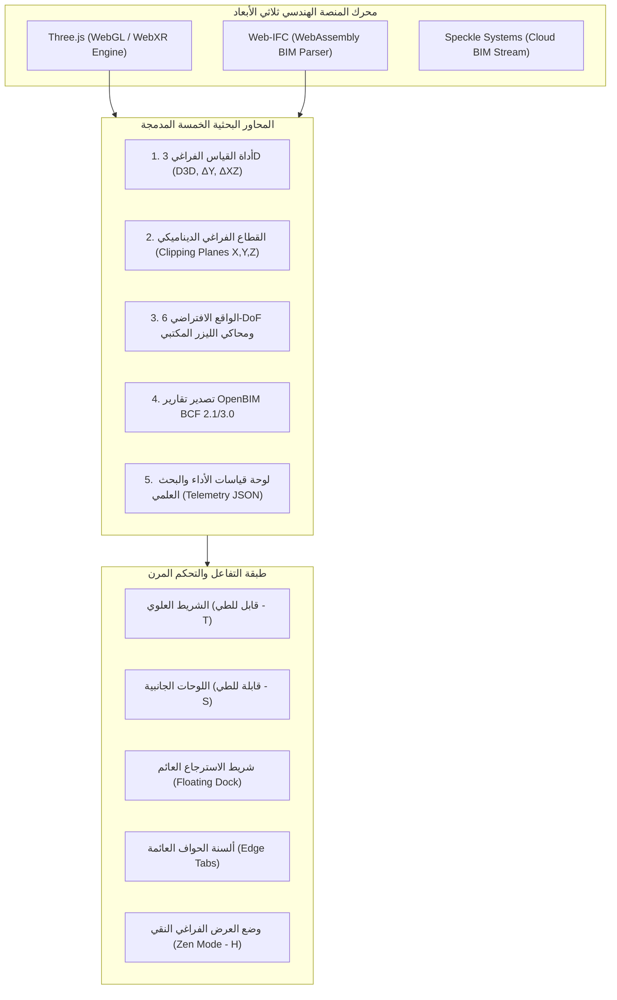

# 📑 سجل التطوير والخطوات البحثية الشامل (Research Development & Conversation Log)
## منصة مراجعة التصاميم الفراغية وتنسيق نماذج الـ BIM والواقع الافتراضي عبر الويب
### Open-Source WebXR BIM Design Review & Coordination Research System

---

> **الباحث والمطور الرئيسي:** المهندس المعماري الدكتور **أحمد لؤي أحمد** (*Architect Dr. Ahmed Louay Ahmed*)  
> **مجال البحث:** نمذجة معلومات البناء (BIM)، الواقع الافتراضي الغامر (WebXR)، واكتشاف التعارضات (Clash Detection & Coordination) بمقياس إنساني $1:1$  
> **المستودع الرئيسي (GitHub):** [https://github.com/DrAhmedLouay/webxr-bim-review](https://github.com/DrAhmedLouay/webxr-bim-review)  
> **المنصة الحية (GitHub Pages):** [https://drahmedlouay.github.io/webxr-bim-review/](https://drahmedlouay.github.io/webxr-bim-review/)  
> **تاريخ التوثيق والتحديث:** سبتمبر 2026

---

## 📌 فهرس السجل البحثي

1. [المقدمة والرؤية العلمية للمنصة](#1-المقدمة-والرؤية-العلمية-للمنصة)
2. [سجل المحادثات والمطالب التطويرية خطوة بخطوة (Chronological Log)](#2-سجل-المحادثات-والمطالب-التطويرية-خطوة-بخطوة)
   - [المرحلة 1: حل مشكلة بياض مجسمات IFC وتمييز الألوان والبيئة](#مرحلة-1-حل-مشكلة-بياض-مجسمات-ifc-وتمييز-الألوان-والبيئة)
   - [المرحلة 2: إصلاح وتفعيل تصفية العناصر وعزل الطوابق 60 FPS](#مرحلة-2-إصلاح-وتفعيل-تصفية-العناصر-وعزل-الطوابق-60-fps)
   - [المرحلة 3: توثيق الهوية الأكاديمية والبحثية للمنصة](#مرحلة-3-توثيق-الهوية-الأكاديمية-والبحثية-للمنصة)
   - [المرحلة 4: ترقية المجسم الافتراضي الثلاثي الأبعاد ومطابقته للواقع](#مرحلة-4-ترقية-المجسم-الافتراضي-الثلاثي-الأبعاد-ومطابقته-للواقع)
   - [المرحلة 5: إضافة نظام استعراض وتتبع التعارضات الفراغية (View Clashes)](#مرحلة-5-إضافة-نظام-استعراض-وتتبع-التعارضات-الفراغية-view-clashes)
   - [المرحلة 6: خوارزمية منع تكرار تسجيل التعارضات](#مرحلة-6-خوارزمية-منع-تكرار-تسجيل-التعارضات)
   - [المرحلة 7: تمييز الكتل المختارة بالإشعاع السماوي اللحظي (Radiant Selection Highlight)](#مرحلة-7-تمييز-الكتل-المختارة-بالإشعاع-السماوي-اللحظي)
   - [المرحلة 8: دمج المحاور البحثية الخمسة المتقدمة (The 5 Research Pillars)](#مرحلة-8-دمج-المحاور-البحثية-الخمسة-المتقدمة-the-5-research-pillars)
   - [المرحلة 9: توضيح ودعم تجربة الواقع الافتراضي WebXR ومحاكي الليزر المكتبي](#مرحلة-9-توضيح-ودعم-تجربة-الواقع-الافتراضي-webxr-ومحاكي-الليزر-المكتبي)
   - [المرحلة 10: نظام إظهار وإخفاء شرائط المهام العلوية والجانبية (Zen Mode)](#مرحلة-10-نظام-إظهار-وإخفاء-شرائط-المهام-العلوية-والجانبية-zen-mode)
3. [المصفوفة التقنية والهندسية للمنصة (Technical Architecture Matrix)](#3-المصفوفة-التقنية-والهندسية-للمنصة)
4. [دليل اختصارات وأزرار الاستخدام والتشغيل](#4-دليل-اختصارات-وأزرار-الاستخدام-والتشغيل)
5. [كيفية الوصول إلى ملفات المحادثات الخام ومسارات النظام (Transcripts & System Paths)](#5-كيفية-الوصول-إلى-ملفات-المحادثات-الخام-ومسارات-النظام)

---

## 1. المقدمة والرؤية العلمية للمنصة

تم بناء وتطوير هذه المنصة كنموذج بحثي وتطبيقي متقدم يقوده الدكتور المهندس المعماري **أحمد لؤي أحمد**، بهدف دراسة وتطبيق:
* استبدال بيئات مراجعة الـ BIM التقليدية الثقيلة (Revit / Navisworks) ببيئة ويب تفاعلية سريعة ومفتوحة المصدر (**OpenBIM & WebXR**).
* تمكين الفحص الفراغي المباشر والتجول بمقياس حقيقي $1:1$ لاكتشاف تعارضات شبكات الهندسة الميكانيكية والكهربائية والصحية (MEP) مع الهياكل الإنشائية والمعمارية داخل نظارات الواقع الافتراضي مثل **Meta Quest (2 / 3 / Pro)** دون الحاجة لحواسيب باهظة أو برمجيات احتكارية.
* تقديم أدوات قياس دقيقة، وقطاعات هندسية ديناميكية، وتصدير تقارير التعارضات المفتوحة (**OpenBIM BCF 2.1/3.0**)، مع رصد الأداء اللحظي بمؤشرات قياس علمية كمية دقيقة (FPS, Triangles, Draw Calls, Memory).

---

## 2. سجل المحادثات والمطالب التطويرية خطوة بخطوة

---

### مرحلة 1: حل مشكلة بياض مجسمات IFC وتمييز الألوان والبيئة
* **المطلب:** *"عند استيراد ملف IFC تظهر الوان المجسم فاقعة البياض ولا يمكن تمييز العناصر، اضف خاصية تمييز الالون واضاءة بيئة العمل"*
* **التحليل الهندسي:**
  - عند استيراد بعض ملفات الـ IFC، إما أن تكون المواد الأصلية بيضاء غير محددة، أو تفتقر إلى خصائص الخامات PBR، مع زيادة شدة الإضاءة المحيطة (`AmbientLight`) مما يسبب تشبعاً ضوئياً (Over-exposure) وانعدام التباين بين الجدران والأنابيب والدكتات.
* **الخطوات التنفيذية:**
  1. إنشاء خوارزمية **تمييز ألوان التخصصات المعمارية والـ MEP** (`Color Coding Engine`):
     - الجدران: رمادي معماري دافئ ناعم (`#cbd5e1`).
     - الأسقف والأرضيات: رمادي داكن محكم (`#64748b`).
     - مجاري الهواء والتكييف (HVAC Ducts): أزرق ميكانيكي مميز (`#0284c7`).
     - أنابيب الأكسجين والغازات: أصفر هندسي كودي (`#eab308`).
     - مواسير الصرف والصحي: أخضر زمردي (`#10b981`).
     - الأبواب: خشب بني دافئ (`#b45309`).
     - النوافذ والواجهات: زجاج شفاف واقعي (`roughness: 0.1, transmission/opacity: 0.35`) يتيح رؤية التأسيسات الداخلية بوضوح.
  2. اعتماد محرك مطابقة الألوان السينمائية `renderer.toneMapping = THREE.ACESFilmicToneMapping` وضبط التعريض.
  3. إضافة لوحة تحكم بإضاءة بيئة العمل:
     - منزلق شدة السطوع (من 40% إلى 180%).
     - أنماط إضاءة جاهزة: نهاري ساطع (Daylight)، استوديو دافئ (Warm)، واستوديو ليلي داكن (Studio Dark).
     - لوحات تبديل ألوان خلفية المشهد (Dark Slate, Deep Navy, Light Studio).
  4. إضافة زر وصول سريع في الشريط العلوي: `🎨 تمييز الألوان` و `💡 إضاءة البيئة`.
* **التثبيت:** تم التثبيت بالكوميت `a6140da`.

---

### مرحلة 2: إصلاح وتفعيل تصفية العناصر وعزل الطوابق 60 FPS
* **المطلب:** *"تصفية العناصر والتخصصات: لا تعمل"*
* **التحليل الهندسي:**
  - واجهت محركات `web-ifc` حساسية في أحرف أسماء الكيانات (Case Sensitivity) مثل `IFCWALL` مقابل `IfcWallStandardCase`، بالإضافة لتأخر بناء كتل الـ Subset عند كل نقرة، مما سبب تجمداً في المتصفح.
* **الخطوات التنفيذية:**
  1. توحيد قراءة الكيانات عبر مصفوفة فحص شاملة وتحويل النصوص إلى صيغة موحدة (`toUpperCase()`).
  2. بناء نظام **التخزين المسبق لطبقات الفرز السريع (Pre-cached Subsets)** أثناء قراءة الملف، بحيث تصبح سرعة إخفاء أو إظهار أي تخصص أو طابق $0\text{ ms}$ وبمعدل إطارات ثابت $60\text{ FPS}$.
  3. إضافة خاصية **تفكيك المبنى رأسياً (Exploded View)** عبر منزلق ديناميكي يرفع الطوابق عن بعضها البعض لكشف مسارات التأسيسات المخفية.
  4. منع احتساب الفراغات الهوائية الوهمية (`IfcSpace`) ضمن الشبكة الهندسية الصلبة.
* **التثبيت:** تم التثبيت بالكوميت `b03ecb7` و `b12893d`.

---

### مرحلة 3: توثيق الهوية الأكاديمية والبحثية للمنصة
* **المطلب:** *"اضف في مكان ما في المنصة الجملة التالية: 'هذه المنصة قيد التطوير لاغراض بحثية ، وتم تطويرها من قبل المهندس المعماري الدكتور احمد لؤي احمد'"*
* **الخطوات التنفيذية:**
  1. إدراج الشعار البحثي الرسمي في قلب **الشريط العلوي الرئيسي للمنصة (`#header-bar`)** داخل بطاقة أنيقة زرقاء مشعة بنمط `research-badge`.
  2. إضافة نفس العبارة التوثيقية في **لوحة الإرشادات والتحكم (أسفل يسار الشاشة)** ليراها المستخدم والباحث عند التجول.
* **التثبيت:** تم التثبيت بالكوميت `071fd3c`.

---

### مرحلة 4: ترقية المجسم الافتراضي الثلاثي الأبعاد ومطابقته للواقع
* **المطلب:** *"اجعل عناصر النموذج الافتراضي في الواجهة الرئيسية (المجسم الثلاثي) من الانابيب والدكت وبقية العناصر اقرب للشكل الحقيقي لها"*
* **التحليل الهندسي:**
  - كانت المكعبات والأسطوانات البدائية تفتقر للوصلات الميكانيكية الحقيقية والمواد الواقعية.
* **الخطوات التنفيذية:**
  1. **مجرى الهواء (HVAC Duct):** مجرى صاج مجلفن معدني واقعي مع وصلات شفة بارزة (Flanges) ومخمدات اهتزاز (Vibration Dampers).
  2. **ماسورة الأكسجين والغازات:** أنبوب نحاسي كودي ناصع مع صمام قفل برونزي كروي ثلاثي الأبعاد (Ball Valve with Handle).
  3. **أنبوب الصرف الصحي:** مواسير PVC سميكة مع كوع ومصيدة مياه (P-Trap) متقنة.
  4. **العناصر المعمارية والإنشائية:** باب خشبي واقعي بمقبض ألمنيوم، وأعمدة وكمرات خرسانية مسلحة متباينة، مع تشطيب جدران وأرضيات يوضح خلوصات الصيانة الحقيقية.
* **التثبيت:** تم التثبيت بالكوميت `2eaab79`.

---

### مرحلة 5: إضافة نظام استعراض وتتبع التعارضات الفراغية (View Clashes)
* **المطلب:** *"اضف زر 'مشاهدة التعارضات' بجوار زر 'تقرير التعارضات (CSV)'"*
* **الخطوات التنفيذية:**
  1. إضافة زر بارز باللون الأحمر في شريط الأدوات: **`⚠️ مشاهدة التعارضات`** (`#btn-view-clashes`).
  2. بناء نافذة تفاعلية منبثقة متكاملة (`#clash-review-modal`) تعرض:
     - المعرف الفريد للتعارض (Clash ID).
     - اسم ونوع العنصر المتعارض ونظامه.
     - الأبعاد وخلوص الصيانة والكود المنتهك.
     - زر **`🎯 انتقال إلى الفراغ`**: عند النقر عليه، تحلق الكاميرا بنعومة (`Smooth Flight Animation`) وتتمركز أمام نقطة التعارض مباشرة، مع تشغيل منارة كروية نابضة ومضيئة باللون الأحمر المشع (`clashBeacon`).
     - إمكانية تصدير تقرير BCF أو CSV مباشرة من داخل النافذة.
* **التثبيت:** تم التثبيت بالكوميت `f484ef3`.

---

### مرحلة 6: خوارزمية منع تكرار تسجيل التعارضات
* **المطلب:** *"في حالة تكرار الضغط على عنصر اكثر من مرة لتسجيل تعارض اظهر رسالة بانه العنصر مكرر ولا تقم باضافته"*
* **الخطوات التنفيذية:**
  1. فحص مصفوفة التعارضات المسجلة `clashesList` ومقارنة المعرف الهندسي `elemId`.
  2. في حال وجود العنصر مسبقاً: منع إضافته للمصفوفة وعرض رسالة تنبيهية باللغة العربية تشير إلى أن العنصر مسجل مسبقاً مع توقيت تسجيله ومواصفاته.
  3. تزويد قائمة التعارضات بزر لحذف أو معالجة التعارض (Resolve/Delete) لإعادة ضبط الفحص.
* **التثبيت:** تم التثبيت بالكوميت `f2bd48e`.

---

### مرحلة 7: تمييز الكتل المختارة بالإشعاع السماوي اللحظي
* **المطلب:** *"اضف خاصية عن الضغط على عنصر لتحديده يتميز لونه عن بقية العناصر"*
* **الخطوات التنفيذية:**
  1. هندسة محرك الإبراز اللحظي الموحد (`applyObjectHighlight`):
     - **في ملفات IFC:** استخدام `ifcLoader.ifcManager.createSubset` لإنشاء مجسم تطابق فراغي بلون سماوي مضيء (`0x00f0ff`) وبإشعاع ذاتي (`emissive: 0x00b4d8`) وشفافية لطيفة.
     - **في نماذج WebXR Lab:** حفظ المادة الأصلية لكل شبكة هندسية وحقن مادة تظليل سماوية مشعة، مع استعادة المادة الأصلية بمجرد اختيار عنصر آخر أو النقر في الفراغ.
  2. تحديث لوحة بيانات العنصر المختار فورياً بخصائص الـ BIM.
* **التثبيت:** تم التثبيت بالكوميت `a1ae5bf`.

---

### مرحلة 8: دمج المحاور البحثية الخمسة المتقدمة (The 5 Research Pillars)
* **المطلب:** *"جمع المقترحات الخمسة اعلاه"*
* **التفصيل العلمي للمحاور الخمسة المدمجة:**
  1. **المحور 1: أداة قياس الأبعاد الفراغية بنقرتين (3D Point-to-Point Measurement Tool):**
     - قياس المسافة الفراغية ثلاثية الأبعاد المباشرة ($D_{3D}$).
     - حساب الخلوص الشاقولي الفعلي ($\Delta Y$) لفحص الارتفاعات الصافية أسفل الدكتات.
     - حساب الإزاحة الأفقية المباشرة ($\Delta XZ$) مع رسم خطوط قياس وشعيرات ليزرية عائمة.
  2. **المحور 2: أداة القطاع الفراغي الديناميكي (Dynamic 3D Section Plane):**
     - تفعيل محرك القطع الموضعي `renderer.localClippingEnabled = true`.
     - دعم القطع في المحاور الرئيسية: أفقي ($Y$)، ورأسي عرضي ($X$)، ورأسي طولي ($Z$).
     - منزلق لتعديل موقع القطع بدقة، وزر لعكس اتجاه الرؤية (Invert).
  3. **المحور 3: محرك الواقع الافتراضي 6-DoF ونظارة Meta Quest:**
     - دعم وحدات التحكم اليدوية بست درجات حرية (6 Degrees of Freedom).
     - أشعة ليزر مزدوجة مشعة باللون السماوي تنطلق من أيدي المهندس داخل النظارة.
     - زر الزناد (Index Trigger) لاختيار وفحص العناصر مباشرة بمقياس $1:1$.
  4. **المحور 4: مصدر ومحول تقارير OpenBIM BCF 2.1/3.0:**
     - توليد ملفات تنسيق تعليقات البناء (BIM Collaboration Format) مع حفظ زوايا الكاميرا ونقاط النظر ومعرفات الـ GUIDs للربط المباشر مع برامج Revit و Navisworks و Solibri.
  5. **المحور 5: لوحة قياسات الأداء والبحث العلمي (Scientific Telemetry HUD):**
     - تتبع لحظي لمعدل الإطارات (FPS)، زمن معالجة الإطار (Frame Time ms)، عدد المضلعات (Triangles)، نداءات الرسم (Draw Calls)، واستهلاك الذاكرة.
     - زر لتصدير تقرير القياسات بتنسيق `JSON` لتضمينه في الأوراق والرسائل العلمية.
* **التثبيت:** تم التثبيت بالكوميت `72f32b1`.

---

### مرحلة 9: توضيح ودعم تجربة الواقع الافتراضي WebXR ومحاكي الليزر المكتبي
* **المطلب:** *"@[Quote] اين هذا التحديث في المنصة؟"*
* **التحليل الهندسي والتوضيح:**
  - تقنية WebXR تعتمد على كشف النظارة؛ فعند الفتح من حاسوب مكتبي يظهر زر `VR NOT SUPPORTED` لأن المتصفح لا يجد خوذة متصلة؛ بينما تظهر التجربة كاملة بزر `ENTER VR` عند الدخول من متصفح النظارة **Meta Quest Browser**.
* **الخطوات التنفيذية:**
  1. إضافة زر دائم في الشريط العلوي: **`🥽 دليل الواقع الافتراضي (VR)`** (`#btn-vr-guide`).
  2. نافذة إرشادية تفاعلية تشرح بالصور والخطوات آلية الدخول بالنظارة ووظائف أزرار أيدي التحكم.
  3. ربط النقر على زر `VR NOT SUPPORTED` بفتح النافذة الإرشادية لضمان عدم وجود نقرات صامتة.
  4. ابتكار **محاكي مؤشر الليزر على سطح المكتب (`Desktop 6-DoF Laser Simulator`)**:
     - إمكانية تشغيل شعاع ليزري ثلاثي الأبعاد مضيء مع حلقة تصويب (Reticle) يتحرك مع مؤشر الفأرة كأنه يد تحكم VR لتجربة نفس آلية التوجيه والالتقاط على الكمبيوتر العادي.
* **التثبيت:** تم التثبيت بالكوميت `063baea`.

---

### مرحلة 10: نظام إظهار وإخفاء شرائط المهام العلوية والجانبية (Zen Mode)
* **المطلب:** *"اضف امكانية اظهار / اخفاء شرائط المهام العلوية والجانبية"*
* **التحليل الهندسي:**
  - في تطبيقات العرض المعماري والهندسي، يحتاج المستخدم إلى شاشة نقية بالكامل (Full Canvas) للتجول واستعراض النموذج دون تشتيت، مع ضرورة وجود وسيلة سريعة وسهلة لاستعادة الأشرطة دون أن يعلق في الشاشة الفارغة.
* **الخطوات التنفيذية:**
  1. أزرار مدمجة في الشريط العلوي:
     - `🔼 إخفاء الشريط` (اختصار: `T`).
     - `📑 القوائم الجانبية` (اختصار: `S`).
     - `🔲 عرض كامل (Zen Mode)` (اختصار: `H` أو `Z`).
  2. شريط تحكم عائم ذكي (`#floating-ui-dock`) يظهر تلقائياً في أعلى المنتصف عند إخفاء الشريط العلوي لاستعادته بنقرة واحدة.
  3. ألسنة تحكم عائمة على حواف الشاشة (`Edge Tabs`):
     - لسان جانبي أيمن `[ ◀ اللوحات الجانبية ]` للتحكم في لوحات الخصائص وتصفية الطوابق.
     - لسان جانبي أيسر `[ ▶ التعليمات ]` للتحكم في لوحة الإرشادات.
  4. زر إغلاق مصغر `✕` أعلى لوحة الإرشادات لطيها بشكل فردي.
  5. دعم كامل لاختصارات لوحة المفاتيح (`T`, `S`, `H`, `Z`, `Esc`) مع حركات انزلاق ناعمة (CSS Transitions) وإشعارات عائمة خفيفة.
* **التثبيت:** تم التثبيت بالكوميت `c3a4f2c`.

---

## 3. المصفوفة التقنية والهندسية للمنصة



---

## 4. دليل اختصارات وأزرار الاستخدام والتشغيل

| الاختصار / الزر | الوظيفة الهندسية والتشغيلية |
| :---: | :--- |
| **`T`** أو `🔼 إخفاء الشريط` | إظهار / إخفاء شريط الأدوات العلوي لتوسيع زاوية الرؤية الفراغية |
| **`S`** أو `📑 القوائم الجانبية` | إظهار / إخفاء كافة اللوحات والقوائم الجانبية دفعة واحدة |
| **`H`** أو **`Z`** أو `🔲 عرض كامل` | وضع العرض الفراغي الكامل والتركيز النقي (Zen Mode - إخفاء كافة الأشرطة) |
| **`Esc`** | استعادة كافة شرائط وقوائم المنصة فوراً إلى وضعها الطبيعي |
| `📏 قياس الأبعاد` | تفعيل القياس بنقرتين لحساب المسافات وخلوص الارتفاع الشاقولي $\Delta Y$ |
| `✂️ قطاع هندسي` | تفعيل أداة القطاع الفراغي في المحاور وتعديل موضع القطع |
| `📊 مؤشرات الأداء` | فتح لوحة قياسات الأداء وتصدير تقرير الـ JSON للأبحاث العلمية |
| `⚠️ مشاهدة التعارضات` | استعراض قائمة التعارضات الفراغية والطيران بالكاميرا نحو موقع التعارض |
| `🥽 دليل الواقع الافتراضي` | فتح دليل تشغيل نظارة Meta Quest ومحاكي ليزر الـ VR المكتبي |

---

## 5. كيفية الوصول إلى ملفات المحادثات الخام ومسارات النظام

* **سجل المحادثات الخام لنظام Antigravity (JSONL Transcripts):**
  - المسار الكامل على جهاز Mac:
    ```text
    /Users/ahmedlouay/.gemini/antigravity/brain/eacb11e1-e7b8-4176-9e1f-aa490ba4df71/.system_generated/logs/transcript.jsonl
    /Users/ahmedlouay/.gemini/antigravity/brain/eacb11e1-e7b8-4176-9e1f-aa490ba4df71/.system_generated/logs/transcript_full.jsonl
    ```
  - يحتوي هذا الملف على كل أمر وسؤال ومخرجات الأدوات وأوقات التنفيذ بالتفصيل الدقيق (JSON Lines).

* **ملفات الأبحاث والوثائق المرجعية (Artifacts):**
  - المسار المحلي:
    ```text
    /Users/ahmedlouay/.gemini/antigravity/brain/eacb11e1-e7b8-4176-9e1f-aa490ba4df71/integrated_webxr_bim_research_system.md
    /Users/ahmedlouay/.gemini/antigravity/brain/eacb11e1-e7b8-4176-9e1f-aa490ba4df71/clash_matrix_specification.md
    ```

* **مستودع الكود المصدري وسجل Git التاريخي:**
  - المجلد المحلي: `/Users/ahmedlouay/.gemini/antigravity/scratch/webxr-bim-viewer/`
  - يمكن في أي وقت استعراض التاريخ الكامل للتعديلات عبر الأمر:
    ```bash
    git log --stat
    ```
  - أو استعراض السجل المباشر من خلال صفحة الـ Commits على GitHub:  
    [https://github.com/DrAhmedLouay/webxr-bim-review/commits/main](https://github.com/DrAhmedLouay/webxr-bim-review/commits/main)
